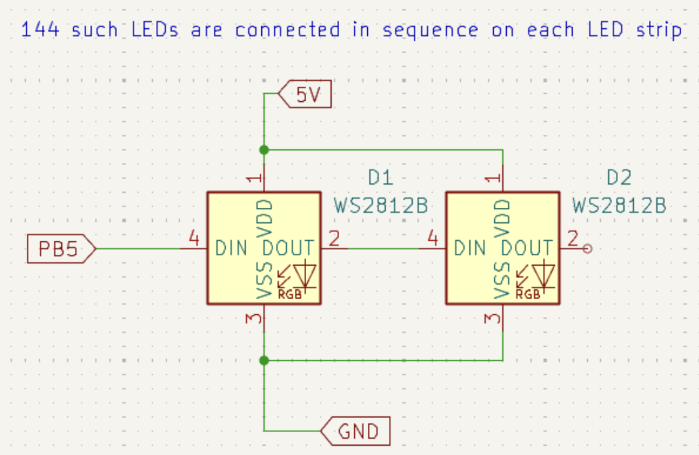
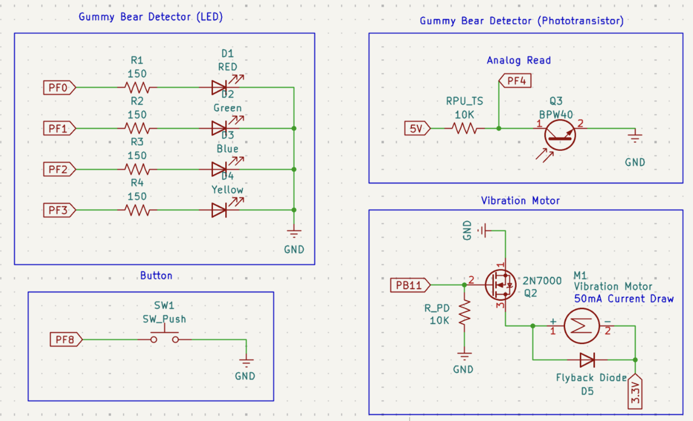
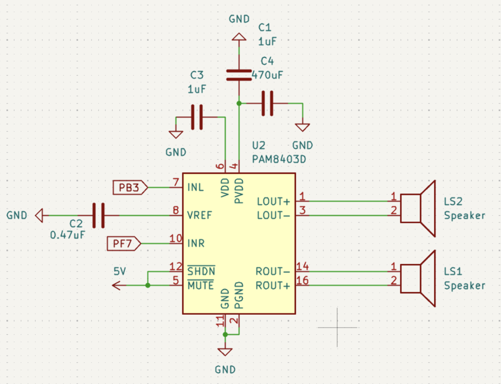
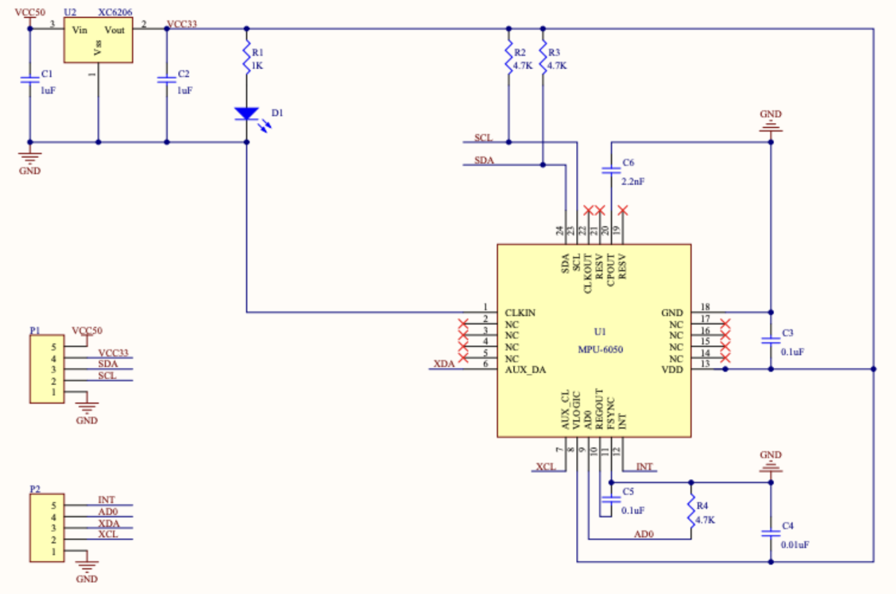
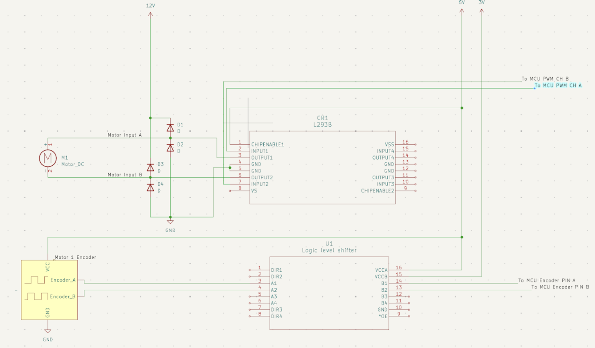
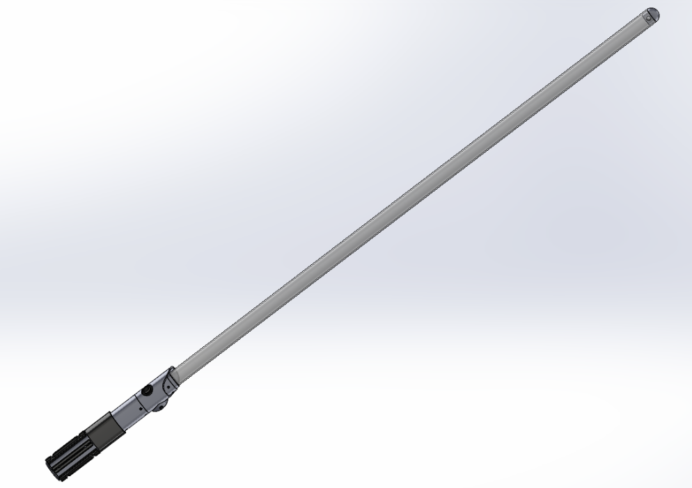

# Return of the Jediodes

## Watch our videos

### Product Video
<a href="https://www.youtube.com/watch?v=UW9I1-rcZVI&feature=youtu.be" style="position: relative; display: inline-block;">
  
  <div style="position: absolute; top: 50%; left: 50%; transform: translate(-50%, -50%); width: 68px; height: 48px; background-color: rgba(23, 35, 34, 0.9); border-radius: 14px; display: flex; align-items: center; justify-content: center; cursor: pointer; transition: background-color 0.2s;">
    <svg height="100%" version="1.1" viewBox="0 0 68 48" width="100%" style="position: absolute; top: 0; left: 0;">
      <path d="M66.52,7.74c-0.78-2.93-2.49-5.41-5.42-6.19C55.79,.13,34,0,34,0S12.21,.13,6.9,1.55 C3.97,2.33,2.27,4.81,1.48,7.74C0.06,13.05,0,24,0,24s0.06,10.95,1.48,16.26c0.78,2.93,2.49,5.41,5.42,6.19 C12.21,47.87,34,48,34,48s21.79-0.13,27.1-1.55c2.93-0.78,4.63-3.26,5.42-6.19C67.94,34.95,68,24,68,24S67.94,13.05,66.52,7.74z" fill="#f00"></path>
      <path d="M 45,24 27,14 27,34" fill="#fff"></path>
    </svg>
  </div>
</a>

### Explanation Video
<a href="https://www.youtube.com/watch?v=3KDqaMYb6dk&feature=youtu.be" style="position: relative; display: inline-block;">
  
  <div style="position: absolute; top: 50%; left: 50%; transform: translate(-50%, -50%); width: 68px; height: 48px; background-color: rgba(23, 35, 34, 0.9); border-radius: 14px; display: flex; align-items: center; justify-content: center; cursor: pointer; transition: background-color 0.2s;">
    <svg height="100%" version="1.1" viewBox="0 0 68 48" width="100%" style="position: absolute; top: 0; left: 0;">
      <path d="M66.52,7.74c-0.78-2.93-2.49-5.41-5.42-6.19C55.79,.13,34,0,34,0S12.21,.13,6.9,1.55 C3.97,2.33,2.27,4.81,1.48,7.74C0.06,13.05,0,24,0,24s0.06,10.95,1.48,16.26c0.78,2.93,2.49,5.41,5.42,6.19 C12.21,47.87,34,48,34,48s21.79-0.13,27.1-1.55c2.93-0.78,4.63-3.26,5.42-6.19C67.94,34.95,68,24,68,24S67.94,13.05,66.52,7.74z" fill="#f00"></path>
      <path d="M 45,24 27,14 27,34" fill="#fff"></path>
    </svg>
  </div>
</a>

A customizable interactive Star Wars themed lightsaber experience with lightsaber building, dueling capabilities.

**Team Members:** 
Atharva Ramdas, David Seong, Korell Adikpeto, Pubordee Aussavavirojekul, Vrishabh Kenkre

**Course:** Advanced Mechatronic Design 16-878, Carnegie Mellon University  

## Table of Contents
- [Introduction](#introduction)
- [Features](#features)
- [Technical Constraints](#technical-constraints)
- [System Architecture](#system-architecture)
- [Tech Stack](#tech-stack)
- [Gameplay](#gameplay)
- [Hardware Design](#hardware-design)
- [Bill of Materials](#bill-of-materials)
- [Setup and Installation](#setup-and-installation)
- [Future Development](#future-development)
- [License](#license)
- [Acknowledgments](#acknowledgments)
- [Contact](#contact)

## Introduction

Return of the Jediodes is an embedded systems/mechatronics project that brings the iconic Star Wars lightsaber to life through a combination of sensor-based customization and reaction-based gameplay. 

Users can customize their lightsaber blade color by scanning a colored gummy bear, then engage in a timed parrying game against Darth Vader, swinging the saber in response to directional, haptic cues while the Imperial March plays in the background.

### Project Motivation

There is significant demand for lightsaber replicas and experiences, from Disney's Savi's Workshop to competitive lightsaber dueling. Our project aims to deliver an all-in-one, budget-friendly device that combines customization, interactivity, and entertainment into a single platform.

## Technical Constraints
This project was developed under significant technical constraints that required building everything from scratch:

### Prohibited Components
- ❌ **No pre-built libraries** 
- ❌ **No sensor libraries**
- ❌ **No libraries whatsoever**
- ❌ **No batteries** (tethered to power supply)
- ❌ **No easier microcontrollers** (Arduino, ESP32, Raspberry Pi, ...)

### Required Approach
- ✅ **Embedded programming** on STM32F446ZE Nucleo boards
- ✅ **Register manipulation** for all peripherals
- ✅ **Custom drivers** for I²C, DMA, PWM, ADC, GPIO, timers
- ✅ **Manual timing and protocol implementation**
- ✅ **From-scratch state machine architecture**

## Features

- **Color Customization**: Scan gummy bears (red, blue, green, yellow) to detect and set blade color
- **Motion-Based Gameplay**: Swing detection using 6-axis IMU (MPU6050)
- **Synchronized Audio**: Imperial March gameplay music, Star Wars theme soundtrack, suite of lightsaber sound effects
- **RGB LED Blade**: Two parallel Neopixel LED strips (288 LEDs total)
- **Visual Feedback**: Mechanical flipboards display directional cues and countdown timer
- **Haptic Feedback**: Vibration motors signal parry windows
- **Reaction-Based Scoring**: Detect correct/incorrect swings with LED color feedback
- **Victory/Defeat Sequences**: Unique audiovisual celebrations or defeat animations

## System Architecture

The system consists of two distributed STM32F446ZE Nucleo boards communicating via GPIO:

### Primary Nucleo (Saber Controller)
- Main state machine orchestration
- LED strip control (Timer 3 + DMA)
- Audio playback (Timer 2, Timer 11)
- IMU data acquisition (I²C + DMA)
- Swing detection algorithm
- Gummy bear color detection
- Vibration motor control
- Score tracking

### Secondary Nucleo (Flipboard Controller)
- Directional flipboard (Motor A)
- Timer countdown dial (Motor B)
- Encoder feedback (Timer 8)
- PID position control
- GPIO interrupt-based communication

## Tech Stack

### Hardware Components

#### Sensors & Input
- **MPU6050**: 6-axis IMU (3-axis accelerometer + 3-axis gyroscope)
- **Phototransistor**: Ambient light sensing for gummy bear color detection
- **Button**: User input for state transitions
- **Quadrature Encoders**: Motor position feedback

#### Actuators & Output
- **2× Neopixel LED Strips**: WS2812B, 144 LEDs each (288 total)
- **2× Vibration Motors**: FIT0774, 50mA @ 3.3V haptic feedback
- **2× DC Motors**: Position-controlled flipboard displays
- **2× Analog Speakers**: 1W, 8Ω with PAM8403D amplifiers

#### Electronics
- **2× STM32F446ZE Nucleo-144**: ARM Cortex-M4 @ 180MHz
- **L293B Motor Driver**: H-bridge for DC motor control
- **I²C Bus Extender**: Long-distance communication

#### Mechanical
- **3D Printed Hilt**: PLA (black, silver, translucent), modular assembly
- **3D Printed Blade Diffuser**: Clear polycarbonate tube with 3D printed end cap
- **Flipboard Mechanisms**: 3D printed, laser cut MDF

### Software Architecture

#### Low-Level Drivers (Hardware Abstraction)
```
hardware_stm_gpio.c/h              - GPIO configuration and control
hardware_stm_timer2_and_11.c/h     - Audio PWM generation
hardware_stm_timer3.c/h            - LED strip PWM + DMA
hardware_stm_timer4.c/h            - Global millisecond clock
hardware_stm_timer5.c/h            - Motor PWM control
hardware_stm_timer8.c/h            - Encoder interface
hardware_stm_timer10.c/h           - IMU timing clock
hardware_stm_adc.c/h               - Analog-to-digital conversion
hardware_stm_dma_controller.c/h    - DMA stream management
hardware_stm_interruptcontroller.c/h - NVIC and interrupt routing
i2c.c/h                            - I²C1 master + DMA
```

#### Sensor & Actuator Drivers
```
mpu6050.c/h                        - IMU driver with DMA acquisition
swing_detector.c/h                 - Gyroscope integration & classification
led_strip_utils.c/h                - WS2812B protocol implementation
audio.c/h                          - Melody generation from note arrays
gummy_led_utils.c/h                - Color detection LED cycling
```

#### Application Layer
```
main.cpp/h                         - Initialization and main loop
state_machine.c/h                  - Game state transitions and logic
events.c/h                         - Event queue implementation
TimeOut.c/h                        - Non-blocking timeout scheduler
global_time.c/h                    - Millisecond timestamp provider
motorA_state_machine.c/h           - Directional display sequencer
motorB_state_machine.c/h           - Timer dial controller
```

#### WS2812B LED Protocol
- **Timing**: 1.3 µs period PWM via Timer 3 Channel 2
- **Encoding**: 68% duty = logical HIGH, 32% duty = logical LOW
- **DMA Transfer**: Direct memory access to CCR register for zero CPU overhead
- **Data Rate**: 800 kHz bit stream (24 bits per LED × 288 LEDs)

#### GPIO Cross-Talk
- **Motor A Trigger (PA8)**: Rising edge EXTI → single flip
- **Motor B Enable (PA9)**: Level-sensitive countdown control

## Gameplay

### State Machine Flow


#### 1. **IDLE (Welcoming State)**
- Bottom 2 LEDs glow
- Star Wars theme music plays
- Awaits button press

#### 2. **SABER_INITIALIZE**
- Cycles through 4 LEDs (red, blue, green, yellow)
- Phototransistor reads reflected light intensity
- Determines gummy bear color via thresholding
- Beep sound on each LED activation

#### 3. **SABER_TURN_ON**
- LEDs gradually light up (5ms per LED, 144 total)
- Lightsaber ignition sound effect
- Blade fully extends in chosen color

#### 4. **SABER_READY**
- Full blade illuminated in selected color
- Awaits button press to start game
- 10-second timeout returns to IDLE

#### 5. **IN_GAME_WAITING**
- Imperial March begins playing
- Motor A flips to random direction (UP/DOWN/LEFT/RIGHT)
- Motor B advances timer dial every 5 seconds
- Each round lasts 5 seconds
- Transitions to IN_GAME_PARRYING at 2.5 second mark

#### 6. **IN_GAME_PARRYING**
- Vibration motor activates (haptic cue)
- 1-second swing detection window
- IMU samples at 30Hz, integrates gyroscope data
- Successful parry: blade blinks WHITE (500ms)
- Failed parry: blade blinks RED (500ms)
- Returns to IN_GAME_WAITING

#### 7. **END_OF_GAME**
- **Victory** (≥4/6 correct swings):
  - Blade blinks in saber color
  - Victory fanfare plays
  - Vibration motors celebrate
- **Defeat** (<4/6 correct):
  - Blade blinks RED
  - Defeat sound effect plays
- Lasts 10 seconds

#### 8. **SABER_TURN_OFF**
- LEDs gradually turn off (5ms per LED)
- Lightsaber deactivation sound
- Returns to IDLE

## Hardware Design

### Schematics

#### LED Strip Circuit


Two WS2812B strips (144 LEDs each) connected in parallel to PB5 via Timer 3 Channel 2. Data signal generated using PWM + DMA at 800 kHz.



#### Gummy Bear Detector
Four LEDs (red, blue, green, yellow) cycle sequentially. Phototransistor measures reflected light intensity via ADC. 12-bit readings thresholded to determine gummy color.

#### Vibration Motor
FIT0774 vibration motor (50mA draw) driven through N-channel MOSFET with flyback diode protection. GPIO pin controls gate voltage.

#### Push Button
Push button input for activating the lightsaber and transitioning between game stages.

#### Speaker System


Dual speakers with PAM8403D amplifier. PWM signals from Timer 2 Channel 2 and Timer 11 Channel 1 converted to audio frequencies.

#### MPU6050 IMU


Connected via I²C1 (PB8/PB9) with pull-up resistors. I²C bus extender used for long cable runs. Decoupling capacitors on VDD and VLOGIC.

#### Motor Driver


L293B H-bridge drives two DC motors with encoder feedback. Logic-level shifter interfaces 3.3V Nucleo signals to 5V motor driver inputs.

### Mechanical Design

#### Lightsaber Hilt

**Components:**
- Modular 3D printed sections (black silk PLA)
- Internal compartments for Nucleo, IMU, vibration motors
- Phototransistor detection chamber
- Button mounting port
- Cable management channels

#### Blade Assembly
- **Material**: 1" OD polycarbonate tube (1/16" wall thickness)
- **Length**: 48 inches
- **Diffusion**: Clear PLA end cap for light scatter
- **LED Strips**: Mounted on internal bracket

#### Flipboard Display


**Directional Board (Motor A):**
- 7 card faces: WELCOME, UP, DOWN, LEFT, RIGHT, VICTORY, LOSS
- Open-loop PWM control with timed flip duration
- Dimensions: 14.75" × 11.57"

**Timer Dial (Motor B):**


- 8 card faces: I, II, III, IV, V, VI, X
- Closed-loop PID position control using encoder
- 5-second countdown intervals
- Dimensions: 4.68" × 7.32"

## Bill of Materials

| Qty | Item | Vendor | Price | Link |
|-----|------|--------|-------|------|
| 1 | MPU6050 IMU | Amazon | $10.99 | [Link](https://amazon.com) |
| 1 | Clear PLA Filament | Amazon | $18.99 | [Link](https://amazon.com) |
| 1 | Black Silk PLA Filament | Amazon | $16.99 | [Link](https://amazon.com) |
| 1 | Silver Silk PLA Filament | Amazon | $16.99 | [Link](https://amazon.com) |
| 2 | WS2812B LED Strip (3.3ft, 144 LEDs) | Amazon | $9.99 each | [Link](https://amazon.com) |
| 1 | PAM8403D Audio Amplifier | Amazon | $5.69 | [Link](https://amazon.com) |
| 1 | 8Ω 1W Speakers | Amazon | $5.49 | [Link](https://amazon.com) |
| 1 | FIT0774 Vibration Motors | Digikey | $0.99 | [Link](https://digikey.com) |
| 1 | Polycarbonate Tube (1" OD, 8ft) | McMaster | $22.85 | [Link](https://mcmaster.com) |
| 0 | I²C Bus Extender | Amazon | $18.00 | [Link](https://amazon.com) |
| 1 | Haribo Tropical Gummy Bears | Local | $1.00 | - |
| 1 | Diffusion Window Film | Amazon | $5.99 | [Link](https://amazon.com) |
| 2 | DC Motors with Encoders | Class Inventory | - | - |
| 1 | L293B Motor Driver | Class Inventory | - | - |
| 2 | STM32F446ZE Nucleo-144 | Class Inventory | - | - |

**Total Budget:** ~$134.97 (excluding class inventory items), less than 100$ if excluding filaments
**Personal Contributions:** Motors, Nucleo boards, motor driver from class inventory

## Setup and Installation

### Hardware Assembly


1. **Print 3D Components**
   - Hilt sections (black silk PLA)
   - Blade end cap (clear PLA)
   - Flipboard mounts and card holders
   - Timer dial assembly

2. **Assemble Lightsaber Hilt**
   - Install Nucleo board in central compartment
   - Mount MPU6050 IMU with I²C extender
   - Install vibration motors in handle
   - Wire phototransistor and LED array
   - Mount push button on exterior
   - Attach speaker and amplifier

3. **Install Blade Assembly**
   - Cut polycarbonate tube to 48" length
   - Mount LED strips on internal bracket
   - Insert into hilt and secure
   - Attach diffusion end cap

4. **Build Flipboard Display**
   - Assemble motor mounts and card holders
   - Attach directional cards to Motor A
   - Attach Roman numeral cards to Motor B
   - Wire motors to secondary Nucleo
   - Connect encoders

5. **Wire Communication**
   - Connect PA8 (Motor A trigger) between Nucleos
   - Connect PA9 (Motor B enable) between Nucleos
   - Establish common ground

### Software Compilation

#### Pin Configuration

**Primary Nucleo Pinout:**
```
PB5  - LED Strip Data (Timer 3 CH2)
PB3  - Speaker 1 (Timer 2 CH2)
PF7  - Speaker 2 (Timer 11 CH1)
PB8  - I²C1 SCL (MPU6050)
PB9  - I²C1 SDA (MPU6050)
PF0-3 - Gummy LED array
PC0  - Phototransistor ADC
PF8  - Button input (EXTI)
PB11 - Vibration motor control
PA8  - Motor A trigger output
PA9  - Motor B enable output
```

**Secondary Nucleo Pinout:**
```
PA8  - Motor A trigger input (EXTI)
PA9  - Motor B enable input (EXTI)
PC6  - Encoder A CH1 (Timer 8)
PC7  - Encoder A CH2 (Timer 8)
PA0  - Motor A PWM (Timer 5)
PA1  - Motor B PWM (Timer 5)
```

## Future Development

- **Custom PCB Integration**: Design integrated PCB to replace breadboard connections
- **Battery Power**: Implement portable battery pack for untethered operation
- **Microcontroller Upgrade**: Migrate to more powerful MCU for enhanced features
- **Bluetooth Mobile App**: Companion app for customization and score tracking
- **Multiplayer Mode**: Support for multiple lightsabers and competitive dueling
- **Advanced Motion Recognition**: Machine learning-based gesture recognition

## License

**MIT License**

Copyright (c) 2025 Return of the Jediodes Team

Permission is hereby granted, free of charge, to any person obtaining a copy of this software and associated documentation files (the "Software"), to deal in the Software without restriction, including without limitation the rights to use, copy, modify, merge, publish, distribute, sublicense, and/or sell copies of the Software, and to permit persons to whom the Software is furnished to do so, subject to the following conditions:

The above copyright notice and this permission notice shall be included in all copies or substantial portions of the Software.

THE SOFTWARE IS PROVIDED "AS IS", WITHOUT WARRANTY OF ANY KIND, EXPRESS OR IMPLIED, INCLUDING BUT NOT LIMITED TO THE WARRANTIES OF MERCHANTABILITY, FITNESS FOR A PARTICULAR PURPOSE AND NONINFRINGEMENT. IN NO EVENT SHALL THE AUTHORS OR COPYRIGHT HOLDERS BE LIABLE FOR ANY CLAIM, DAMAGES OR OTHER LIABILITY, WHETHER IN AN ACTION OF CONTRACT, TORT OR OTHERWISE, ARISING FROM, OUT OF OR IN CONNECTION WITH THE SOFTWARE OR THE USE OR OTHER DEALINGS IN THE SOFTWARE.

---

## Acknowledgments

- **Instructor & Teaching Staff**: Melissa Orta Martinez, Rajiv Joshi, and Kiran Marquez for guidance
- **Star Wars/Lucasfilm**: Inspiration for theme and design

## Contact


**Team Members:**
- Korell Adikpeto
- Pubordee Aussavavirojekul  
- David Seong
- Vrishabh Kenkre
- Atharva Ramdas

Carnegie Mellon University - Advanced Mechatronic Design

---

**May the Force be with you.** ⚔️

